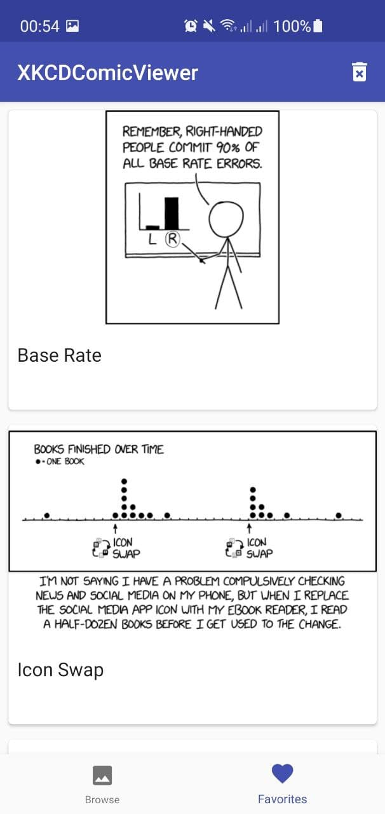
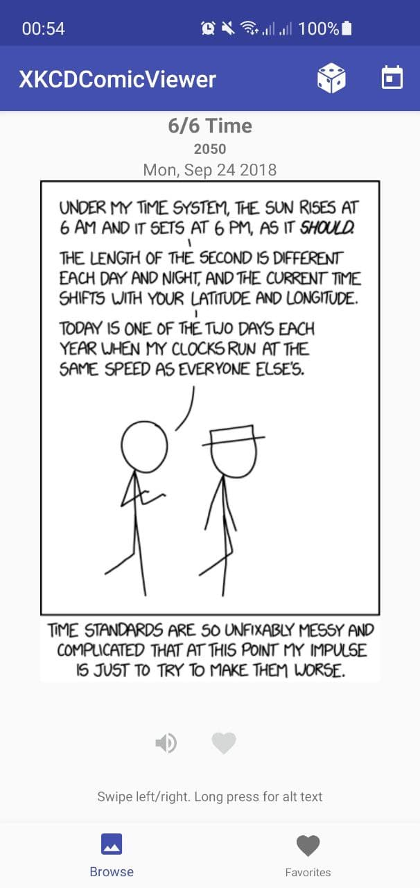
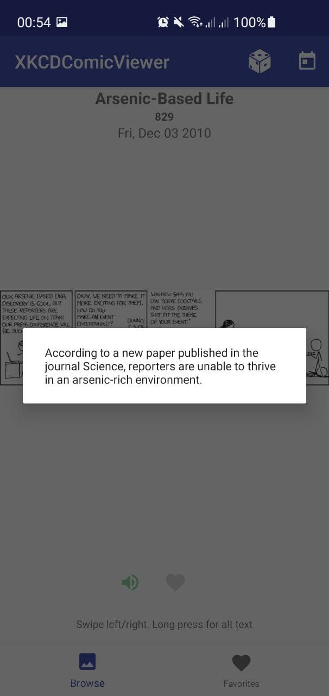
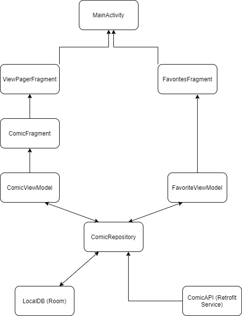

# XKCD Viewer Test Aufgabe.

## Completed User Stories
- [x] User Story #1 - Aktuelles Comic anzeigen,
- [x] User Story #2 - alt-Text für das Comic anzeigen, on long press
- [x] User Story #3 - Zum nächsten und vorherigen Comic springen, ViewPager 
- [x] User Story #4 - Ein zufälliges Comic auswählen, Random
- [x] User Story #5 - Ein Comic als Favorit speichern, LikeButton, Room
- [x] User Story #6 - Favoriten verwalten (optional), erstmal alle löschen :) oder Unlike 
- [x] User Story #7 - Comic vorlesen lassen (optional), TextToSpeech wenn verfügbar ;)

## Libraries
- AndroidX 
- Retrofit2
- PhotoView
- Picasso
- Gson
- RxJava
- PhotoView
- Room

## Screenshots

<table>
 <tr>
  <td>
   
  </td>
  <td>
   
  </td>
  <td>
   
  </td>
  </tr>
 </table>
 
 ## Demo
 [short_demo](assets/video_2021-06-15_21-10-52.gif)
 
  ## App Architecture
  

## TODO's:
- <del>**Refactor** ComicFragment to use ViewModel</del>
- Styles
- Dipendency Injection (evtl. Koin)
- Landscape/Portrait
- Favorite Comic in Fullscreen anschauen
- Show in-progress operations
- Testing :D (Espresso, JUnit?)

#### Author: Artiom Carabas