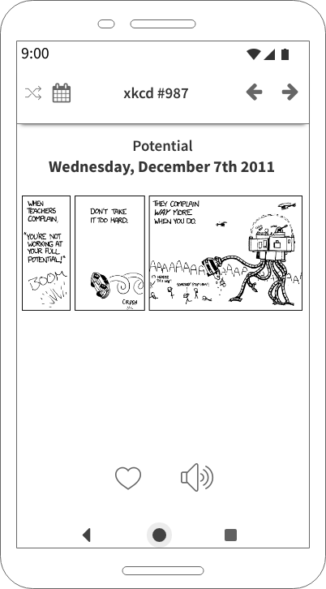

# Aufgabe

Deine Aufgabe ist es eine App zu entwickeln mit der man die Comics von [xkcd](https://xkcd.com) anschauen kann.

## Voraussetzungen

* IDE: **Android Studio**
* Programmiersprache: **Kotlin** oder Java
* UI-Framework: **Android SDK** oder Jetpack Compose
* Es ist erlaubt Third-Party-Libraries zu verwenden


## Abgabe

Bitte reiche dein Ergebnis als **.zip-Archiv** per E-Mail ein.  
Deine Abgabe sollte beinhalten:

* Android Studio Projekt mit komplettem Source Code
* Screenshots oder ein Video (480p) *(optional)*
* Wenn du nicht alle User Stories abgeschlossen hast, eine Liste mit den User Stories die du abgeschlossen hast

Bitte vergewissere dich, dass dein Projekt **ohne Fehler kompiliert** werden kann.

## Funktionsumfang

Die Daten werden von der [xkcd-Webseite](https://xkcd.com) bereitgestellt und sind öffentlich ohne Authentifizierung verfügbar. Es gibt zwei Endpunkte:

* `https://xkcd.com/info.0.json`: gibt das aktuellste Comic zurück
* `https://xkcd.com/{id}/info.0.json`: gibt ein bestimmtes Comic mit der `id` zurück

Bei beiden Endpunkten hat die Antwort das gleiche Schema. Beispiel:

```json
{
    "month": "12",
    "num": 987,
    "link": "",
    "year": "2011",
    "news": "",
    "safe_title": "Potential",
    "transcript": "Narrator: When teachers complain \"You're not working at your full potential!\" \n[[Explosion in background]]\n\nNarrator: Don't take it too hard.\n[[car casually spirals through the air while a crash is heard in the background]]\n\nNarrator: They complain *way* more when you do.\n[[A mechanized, 6-tentacled robot rampages around, picking up cars and creating a small warzone before the student inside while the lamentations of people and the building of military forces are in the background]]\n\n{{Title text: The bunch of disadvantaged kids I was tutoring became too good at writing, and their essays were forcing me to confront painful existential questions, so I started trying to turn them on to drugs and crime instead.}}",
    "alt": "The bunch of disadvantaged kids I was tutoring became too good at writing, and their essays were forcing me to confront painful existential questions, so I started trying to turn them on to drugs and crime instead.",
    "img": "https://imgs.xkcd.com/comics/potential.png",
    "title": "Potential",
    "day": "7"
}
```

Im Kontext dieser Aufgabe soll damit eine einfache REST-API modelliert werden.

**Hinweis:** Auch wenn es sich hierbei um eine einfache Aufgabe handelt, ist es wichtig, dass du auf eine sinnvolle Struktur und gut verständlichen Code achtest.

### User Story #1 - Aktuelles Comic anzeigen

Als Benutzer deiner App soll man die Möglichkeit haben sich das aktuelle Comic in der App anzeigen zu lassen. Die Nummer des Comics, der Titel, das Datum und das Bild werden in der App angezeigt. Das Bild wird automatisch geladen und während das Bild geladen wird, wird ein Platzhalter angezeigt.

**Hinweis:** Es kann sein, dass große Bilder nicht gut lesbar sind.  
**Optional:** Der Benutzer kann in das Bild zoomen und den angezeigten Ausschnitt anpassen.

### User Story #2 - alt-Text für das Comic anzeigen

Alle Comics haben einen alt-Text (`alt`) der auf der Webseite angezeigt wird. Die App soll diesen Text nach einem Longpress auf dem Bild anzeigen. Der Text soll automatisch nach ein paar Sekunden wieder verschwinden.

### User Story #3 - Zum nächsten und vorherigen Comic springen

Der Benutzer hat die Möglichkeit das nächste und das vorherige Comic auszuwählen.

**Hinweis:** Wenn das gewünschte Comic nicht existiert, soll ein Fehler angezeigt werden.

### User Story #4 - Ein zufälliges Comic auswählen

Der Benutzer hat die Möglichkeit ein zufälliges Comic auszuwählen.

**Hinweis:** Mit *zufällig* ist gemeint, dass die `id` des Comics mit `java.util.Random` o.ä. generiert wird.  
**Optional:** Als weitere Option soll der Benutzer zum aktuellen Comic zurück gehen können.

### User Story #5 - Ein Comic als Favorit speichern

Der Benutzer hat die Möglichkeit das Comic als Favorit abzuspeichern. In der ersten Variante soll das Bild in die Fotomediathek des Benutzers gespeichert werden.

### User Story #6 - Favoriten verwalten (optional)

Anstatt die Comics in die Fotomediathek zu speichern, soll die App Favoriten selbst verwalten. Der Benutzer hat in der App die Möglichkeit alle als Favorit markierten Comics (z.B. in einer Liste) anzusehen. Bereits als Favorit markierte Comits können auch wieder entfernt werden.

**Hinweis:** Nach einem Neustart der App sollen die Favoriten erhalten bleiben.

### User Story #7 - Comic vorlesen lassen (optional)

Bei einigen Comics ist ein Transkript verfügbar (`transcript`). Der Benutzer kann sich das Transkript für ein Comic von der App vorlesen lassen. Wenn ein Transkript für das ausgewählte Comic nicht verfügbar ist, soll der Button ausgegraut sein.

## Konzept

Das folgende Wireframe soll als Beispiel für eine **mögliche Umsetzung** der Aufgabe dienen. Selbstverständlich darfst du deiner Kreativität freien Lauf lassen und musst dich nicht an dieses Konzept halten.


